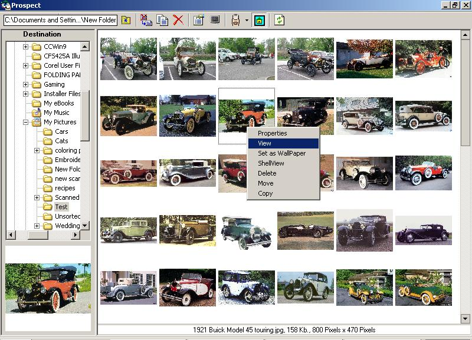



## A Thumbnail Viewer Control

### Description

This version no longer uses RegObj.dll or the scripting runtime. Also fixed the path problems( I hope).

The Thumblist ViewerPane control takes a folder path as an argument and displays all the Jpeg, Bitmap and Gif images in the folder as thumbnails in a resizable viewer pane. The control supports multi-select and has a built in image viewer and property sheet for the selected image. Images may also be selected for copying, moving and deleting. The control also features a configurable right click context menu. Check the screenshot of the test application.

I have loaded 500 thumbs onto the control with no problem.

Note: to run the test application you will require the Common Controls Replacement Project FolderTreeview Control. You select the source folder on the toolbar using the button next to the textbox . The treeview selects the destination path for copying or moving files.

This is available at: http://www.mvps.org/ccrp/controls/ccrpftv6.htm
 
### More Info
 

             |
---                |---
**Submitted On**   |2002-11-26 19:22:54
**By**             |[Alex Schulz](https://github.com/Planet-Source-Code/PSCIndex/blob/master/ByAuthor/alex-schulz.md)
**Level**          |Advanced
**User Rating**    |3.9 (39 globes from 10 users)
**Compatibility**  |VB 6\.0
**Category**       |[Custom Controls/ Forms/  Menus](https://github.com/Planet-Source-Code/PSCIndex/blob/master/ByCategory/custom-controls-forms-menus__1-4.md)
**World**          |[Visual Basic](https://github.com/Planet-Source-Code/PSCIndex/blob/master/ByWorld/visual-basic.md)
**Archive File**   |[A\_Thumbnai15044511272002\.zip](https://github.com/Planet-Source-Code/alex-schulz-a-thumbnail-viewer-control__1-41075/archive/master.zip)

